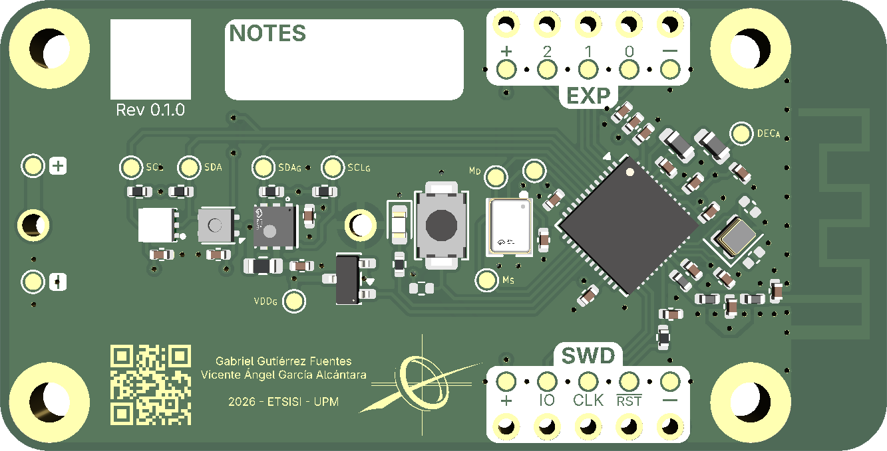
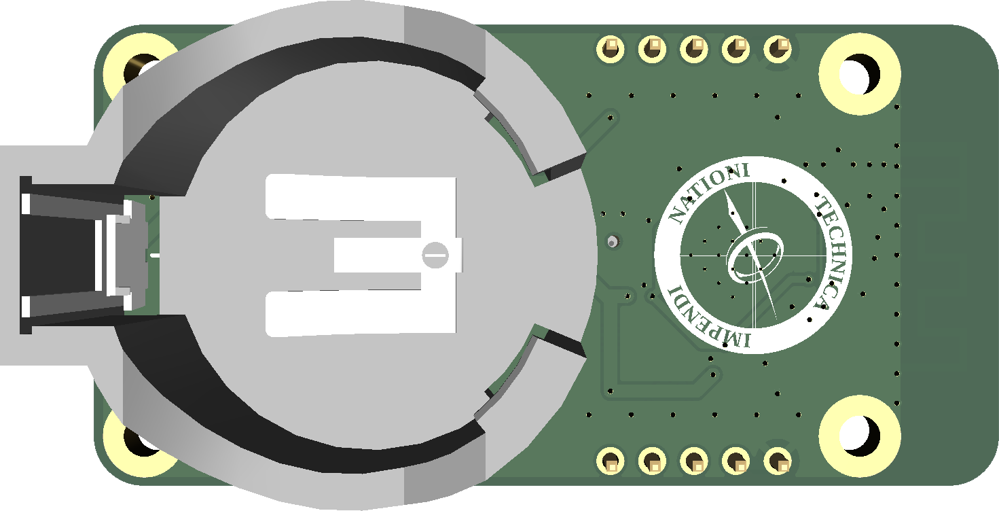

# $SPV\ board$

|  |  |
|--|--|

This is the PCB I designed for my undergrad [thesis](https://www.boe.es/buscar/act.php?id=BOE-A-2021-15781). It's a four-layer board consisting of an [nRF54L15](https://www.nordicsemi.com/Products/nRF54L15), multiple environmental sensors, an LED, and a button, all powered by a single CR2450 battery on the back.

## Sensors
The board has 4 sensors in total:

- [**VEML6035**](https://www.vishay.com/docs/84889/veml6035.pdf): Light sensor by Vishay.
- [**SHTC3**](https://sensirion.com/products/catalog/SHTC3): Temperature and humidity by Sensirion.
- [**SGP40**](https://sensirion.com/products/catalog/SGP40): A VOC Index (not PPM) sensor also by Sensirion. This one's particularly power-hungry, so it's power-gated using a high-side P-FET. It also doesn't actually provide volatile compound concentration measurements, but a more abstract "[VOC Index](https://sensirion.com/media/documents/02232963/6294E043/Info_Note_VOC_Index.pdf)" from 0 to 500, so keep that in mind.
- [**IM70D122**](https://www.infineon.com/part/IM70D122): Noise sensor by Infineon. Though it's technically a digital microphone.

## Functionality
The board is intended to be a cheap weather station. It can be programmed to collect and store data periodically, and then send it over BLE to a smartphone via the nRF54L15 microcontroller.

The [thesis firmware](https://github.com/UPM-SPV/firmware) implements this exact functionality.

## Assembly
The board was mostly designed to keep costs as low as possible. The board can be assembled with JLCPCB's basic assembly, and the majority of the components are in JLCPCB's basic lineup (except the ICs and some passives).

The total cost for a low-volume order is around **€16.68** per board and **€33.52** for the setup fee. Do keep in mind that JLC's basic library changes over time, so this price may change (and probably already has).

## Errata
If you intend on ordering this board, keep in mind that it has some design errors. They are mostly inconsequential and easy to fix and may not even affect you, but still:

- **Push-button does not support interrupts**: probably the most important. The button is connected to P2.05, since the MCU power domain of the nRF54L series does not support interrupts, neither does said pin. The fix is to simply re-route it to any of the other pins (P0 or P1).

- **LED doesn't support PWM**: again, the P2 pins do not have any advanced I/O peripherals, and so the LED can only be toggled on and off, but not dimmed. Re-reoute it to any of the P1 pins (where the GRTC peripheral is) to fix it.

- **Mounting holes are connected to ground**: if you intend on using this outside with a 3D-printed case, using metallic screws could corrode the PCB. Modify the mounting holes so they're covered in solder mask to avoid this. Can be ignored if used indoors.

- **Silkscreen is unreadable in some instances**: the silkscreen text (and solder mask punch-out) is too small and comes out blurry when ordering from JLCPCB. You can probably ignore this, but if it bothers you, make the text bigger.

I'm waiting on a scholarship and currently working on a second revision, so these will be fixed eventually.

## License
This repository and all of its files are released under the [*CERN Open Hardware Licence Version 2 - Strongly Reciprocal*](LICENSE) license.

---
Copyright (c) Gabriel Gutiérrez Fuentes 2026
